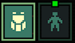
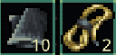
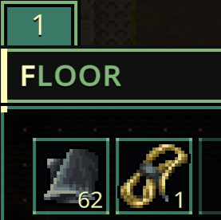

# Quasimorph Red's Optional Modifications Mod

# Modifications Overview
Below is a list of functionality in mod.  By default, all functionality must be enabled in the Mods screen on the main menu.

| Type | Name | Description |
| :--- | :--- | :--- |
| Balance | Ship Speed Boost | Increase the speed of ship travel. |
| QoL | Implant Indicator | Changes the yellow "has augment" dot to green if the inspected creature has an implant|
| QoL | Recycle Hotkey Quick Move | Hold R while hovering over items in the ship cargo to move that item to the recycler tab. |
| QoL | Stack Total Inventory Count| When holding the alt key, the count on stacks will show the total amount of that item owned. This is identical to the number that is shown in the item's tooltip|
| QoL | Hold Reload|Can hold the reload key to keep reloading when waiting and moving.  Useful for single load weapons|
| QoL | Mouse Quick Toss Rebind | Change the key bind for what the game calls "Fast Toss". By default the game uses the Control key to move items between storage panes. |
| QoL | Split Stacks Hotkeys | Adds hotkeys for amount presets and adds "increase" and "decrease" hotkeys. |

 🧪 More items in the future...

For details on each modification, see the related section below.

## Maximum Compatibility
Each modification works like its own mini-mod. Disable one, and it's as if it was never there.  This is useful for working around bugs or handling conflicts with other mods.

See the [Compatibility - Technical](#compatibility---technical) section for details.

# Modifications
## Ship Speed Boost
Changes the ship's speed to decrease travel times.  By default this sets the ship to 2x the speed.

## Implant Indicator

When inspecting a creature during a raid, the yellow "has augment" indicator will be green if there is an implant installed.

## Mouse Quick Toss Rebind
Allows the user to bind the "quick toss" key.  This is where the user can hold the ctrl key down while the mouse is over an item to move the item to the other inventory.
By default it is remapped to middle mouse button (AKA Mouse2).

## Hold Reload
When moving or waiting a turn, holding the Reload key will continue to reload.  For example, if a shotgun requires a reload, the user can hold the Reload key while moving. For each step, a reload will occur as long as the user is still holding the Reload key.

If you are looking for an automated version of the reload, check out Traveler's "Walk and Auto Reload" mod found [here](https://steamcommunity.com/sharedfiles/filedetails/?id=3601126533)

The purpose of my modification is to mirror the base game's requirement to remember to reload, but remove the need to spam the Reload key. I think that forgetting to reload makes some memorable situations. 

### Reloads Before Next Turn
**Important:** There's a quirk in how the reload display works that might seem weird at first, but it's actually working as intended.

Here's what happens:
* You hold down Reload for the first time and the weapon shows it is reloading
* You finish your current action (like moving)
* When the next action starts, the reload indicator *disappears* - this looks broken but it's not!
* Keep holding Reload and end your turn again
* Right before your next action starts, the reload will actually happen (you'll see the reload indicator and hear a click)

**Why does it work this way?**

The mod is designed to protect you from getting caught with your pants down. If the reload happened right at the start of your next action, you'd be stuck reloading even if an enemy suddenly appears. This way, you can react immediately and take a shot instead of being locked into a reload when you need to defend yourself.
 
## Split Stacks Hotkeys
When a stack of items is being split, the split dialog is shown.  This modification adds the following:

Adds increase and decrease hotkeys to change the value by one.  By default it is A and D. 

Adds up to five preset amounts.  For example, the user can press 1 and the dialog will change the "keep" amount (the number on the right) to 10.
By default, 1 is set to 10, and 2 is set to 5.

## Recycle Hotkey Quick Move
Hold R while hovering over items in the ship cargo to move that item to the recycler tab.  Avoids needing to move each item to the recycler with drag and drop.

## Stack Total Inventory Count
When in a screen that shows item stacks, holding alt will show the total amount of each item type that are owned.  This is the same count as found in the tooltip when hovering an item.

**Normal count showing how many items are in the stack:**  

**Holding alt shows the amount currently owned.**  
  
This allows the user to quickly determine if they want to pickup item X or item Y depending on how much of each they already have back in the ship.  
The green color indicates that the user owns 20 or less of that item.  The value can be completely turned off by setting the threshold value to zero.

This number is identical to what is shown on the tooltip, so items that are dropped off in the shuttle or drop pod are not included in the count.

# Compatibility - Technical
For modders, here are the technical details.

Each modification contains their own patches and uses the enabled flag in the Harmony Prepare function to enable the modification.  Non Harmony patches are gated by the same  enable flag.

# Configuration
The configuration can be changed with either the Mod Configuration Menu's "Mods" button on the main menu, or directly in the config file.  The "Mods" button is the preferred route.

The config file is found at is found at `%AppData%\..\LocalLow\Magnum Scriptum Ltd\Quasimorph_ModConfigs\RedsOptionalTweaks\config.json` and will be created the first time the game is run.  Changes will be applied when the game is restarted.

For any key binding items, see the [Key List](#key-list) section below.

## Key List
The list of valid keyboard keys can be found  at the bottom of https://docs.unity3d.com/ScriptReference/KeyCode.html
Beware that numbers 0-9 are Alpha0 - Alpha9.  Most of the other keys are as expected such as X for X.
Use "None" to not bind the key.

# Enjoying the Mods?
If you enjoy my mods and want to buy me a coffee, check out my [Ko-Fi](https://ko-fi.com/nbkredspy71915) page.
Thanks!

# Source Code
Source code is available on GitHub at https://github.com/NBKRedSpy/RedsOptionalTweaks

# Credits
* Special thanks to Crynano for his excellent Mod Configuration Menu.
* The TF2 RedSpy icon is from the reddit user [iwilding](https://www.reddit.com/user/iwilding/) from the post found [here](https://www.reddit.com/r/tf2/comments/2384j5/i_drew_a_red_spy/)
* The Ship Speed Boost is based on Steam user [critic](https://steamcommunity.com/id/cybercritic)'s mod [Ship Speed Boost](https://steamcommunity.com/sharedfiles/filedetails/?id=3548633074).  The functionality is replicated with permission.
* TF2 Font is from [fontriver](https://www.fontriver.com/font/tf2_build/)

# Changes
## 1.5.0
* Added "Hold to Reload" functionality.

## 1.4.0
* Stack Total Inventory Count - Added coloring of items that have a low inventory count.
* Fix for slider hotkeys not working.

## 1.3.0 
* Added Stack Total Inventory Count functionality.

## 1.2.0 
* Added implant indicator.
* Added logging for patch exceptions.

## 1.1.0 
* Added "Move to Recycler" functionality