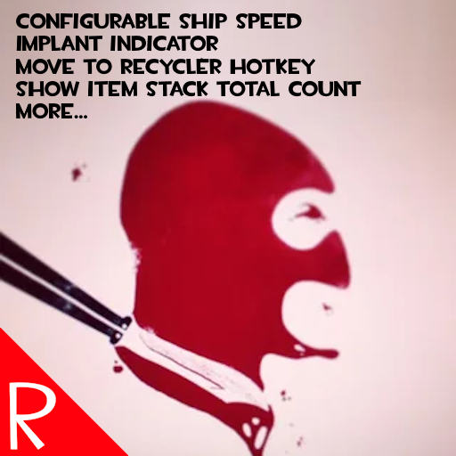

# Quasimorph Red's Optional Modifications Mod

# Modifications Overview
Below is a list of functionality in mod.  

By default, each individual piece of functionality has to be turned on in the Mods -> Red's Optional Tweaks screen.
This allows the user to choose only the changes they want.

| Type | Name | Description |
| :--- | :--- | :--- |
| Balance | Ship Speed Boost | Increase the speed of ship travel. |
| QoL | Implant Indicator | Changes the yellow "has augment" dot to green if the inspected creature has an implant|
| QoL | Recycle Hotkey Quick Move | Hold R while hovering over items in the ship cargo to move that item to the recycler tab. |
| QoL | Stack Total Inventory Count| When holding the alt key, the count on stacks will show the total amount of that item owned. This is identical to the number that is shown in the item's tooltip|
| QoL | Hold Reload|Can hold the reload key to keep reloading when waiting and moving.  Useful for single load weapons|
| QoL | Mouse Quick Toss Rebind | Change the key bind for what the game calls "Fast Toss". By default the game uses the Control key to move items between storage panes. |
| QoL | QMeter Visual| When in a raid, changes the QMorphos state name to yellow when above 800. This matches the music intensity change in the game at this level.|
| QoL | Show Station Info | When a station has a mission, hold the alt key to see the station info.  Important! Must hold down alt before entering the station's UI rectangle.|
| QoL | Split Stacks Hotkeys | Adds hotkeys for amount presets and adds "increase" and "decrease" hotkeys. |
| QoL | Show Experience Maxed | Adds an asterisk to the Experience Item gain tooltip if the merc has the perk, but is already at the max level

 🧪 More items in the future...

Unfortunately Steam has a limit of how much text can be put in a mod's description.

See the full documentation and images here:
https://github.com/NBKRedSpy/RedsOptionalTweaks/blob/main/README.md

## Maximum Compatibility
Each modification works like its own mini-mod. Disable one, and it's as if it was never there.  This is useful for working around bugs or handling conflicts with other mods.
See the [Compatibility - Technical](#compatibility---technical) section for details.

# Enjoying the Mods?
If you enjoy my mods and want to buy me a coffee, check out my [Ko-Fi](https://ko-fi.com/nbkredspy71915) page.
Thanks!

# Source Code
Source code is available on GitHub at https://github.com/NBKRedSpy/RedsOptionalTweaks

# Changes
See the [CHANGELOG.md](./CHANGELOG.md) for the list of changes.

# Credits
* Special thanks to Crynano for his excellent Mod Configuration Menu.
* The TF2 RedSpy icon is from the reddit user [iwilding](https://www.reddit.com/user/iwilding/) from the post found [here](https://www.reddit.com/r/tf2/comments/2384j5/i_drew_a_red_spy/)
* The Ship Speed Boost is based on Steam user [critic](https://steamcommunity.com/id/cybercritic)'s mod [Ship Speed Boost](https://steamcommunity.com/sharedfiles/filedetails/?id=3548633074).  The functionality is replicated with permission.
* TF2 Font is from [fontriver](https://www.fontriver.com/font/tf2_build/)
